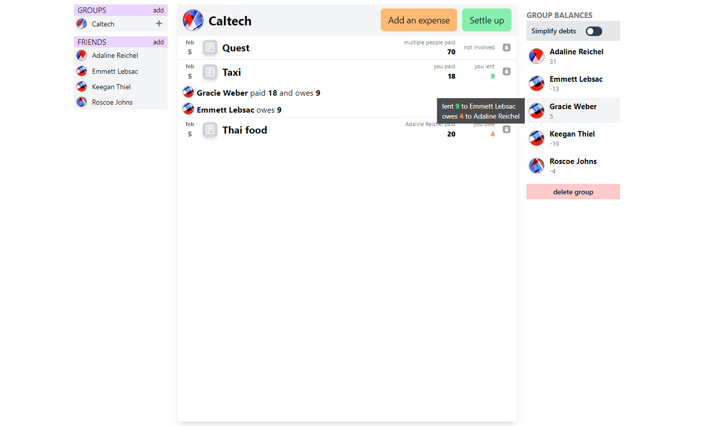

# delimydro

An app for managing expenses with other people. Allows easy addition of expenses, splitting them for many people and displaying their debts.



## Deploy

```
docker compose up --build -d
```
An app will be available on port 8080. Grafana port is 3000.

